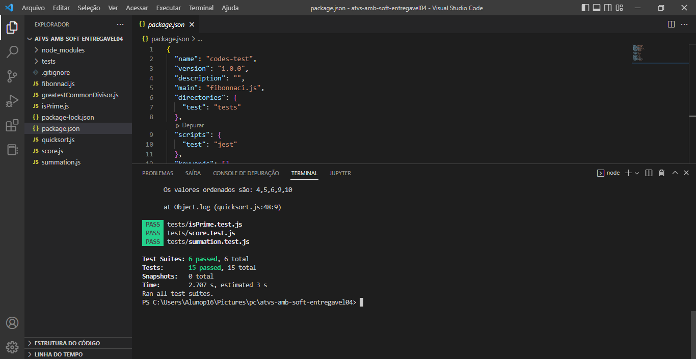

<h1> Entregável - #4</h1> 
    <p>Para o entregável 4, é necessário utilizar os algoritmos base da lógica de programação do primeiro entregável.</p>  
    <p>A partir deles, instalar o jest e aplicar no mínimo dois testes para cada código.</p>

<h1>Projeto:</h1>

**1** - Primeiro, clone o repositório:
```bash
$ git clone git@github.com:paulacynthia/atvs-amb-soft.git
```

**2** - No arquivo do projeto, para instalar todas as dependências necessárias:
``` bash
$ npm install 
```

**3** - Para executar os testes:
``` bash
$ npm run test 
```
<p></p><br/>

<h4 align="center">
   Challenge concluded! :heavy_check_mark:
</h4>
