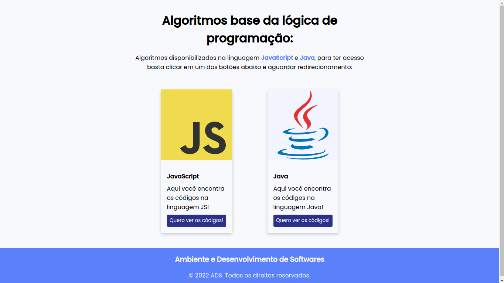
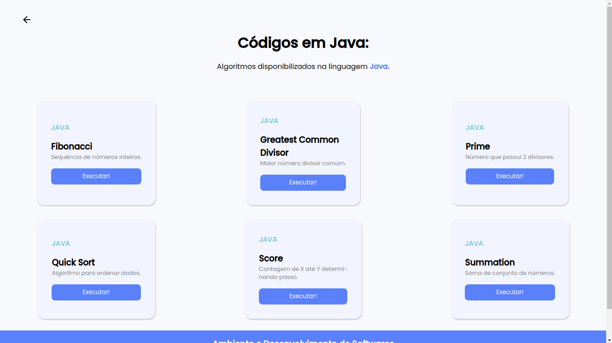
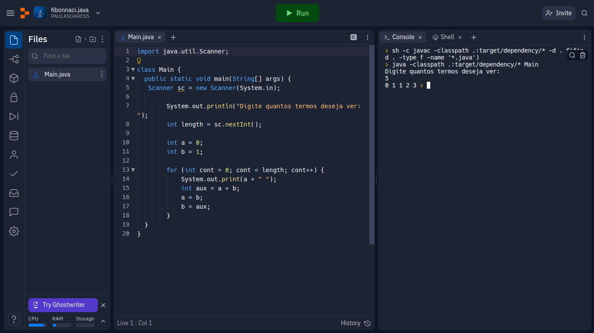
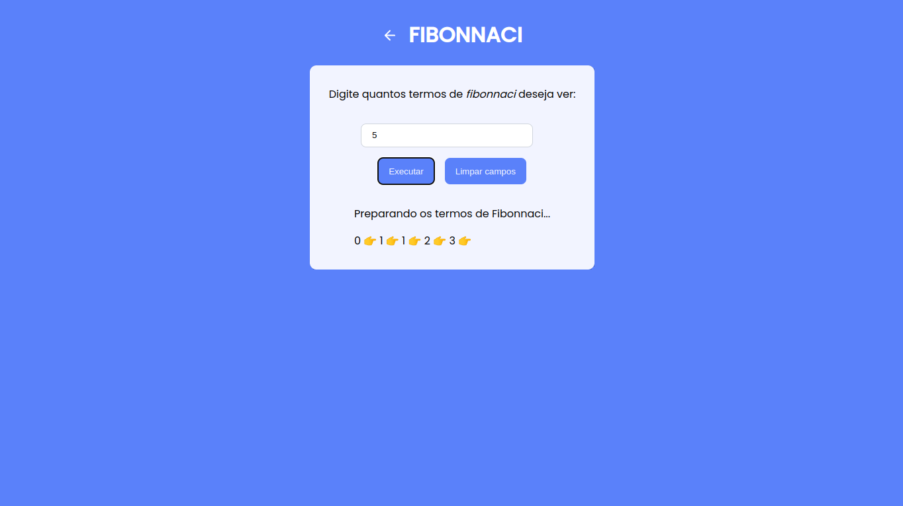

# Entregável - #2
Entregável #2 - Experimentar ferramentas de apoio ao desenvolvimento de software

Utilização dos algoritmos do entregável - #1 para o desenvolvimento de uma interface que execute ambas linguagens de programação

<h1>Projeto:</h1>

**1** - Tela de Home:

 

**2** - Tela de Home Java:

 

**3** - Tela de Execução dos códigos em Java:

 

**4** - Tela de Execução dos códigos em JavaScript:

 

<h2>Deploy:</h2>

<h4 align="center">
   Challenge concluded! :heavy_check_mark:
</h4>
