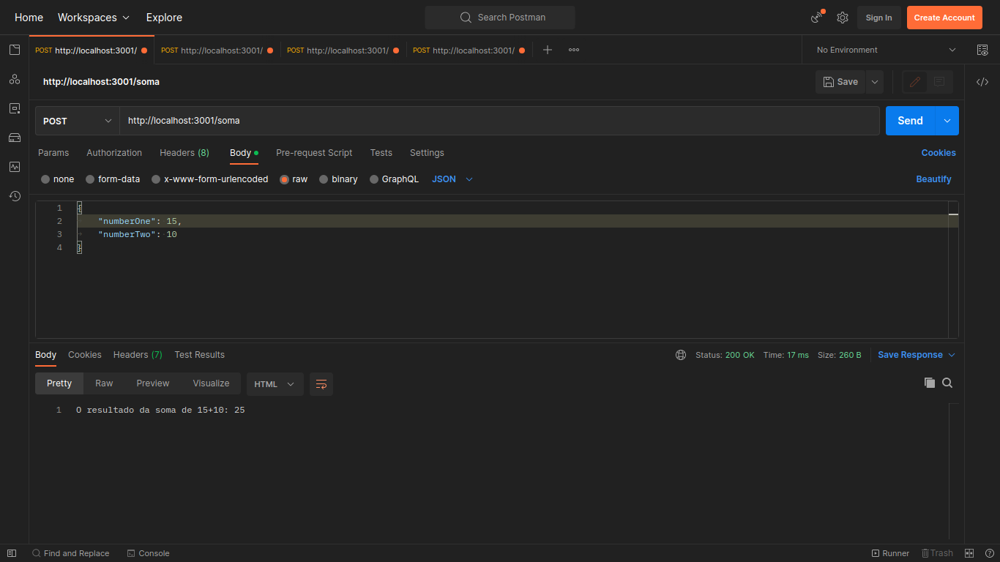
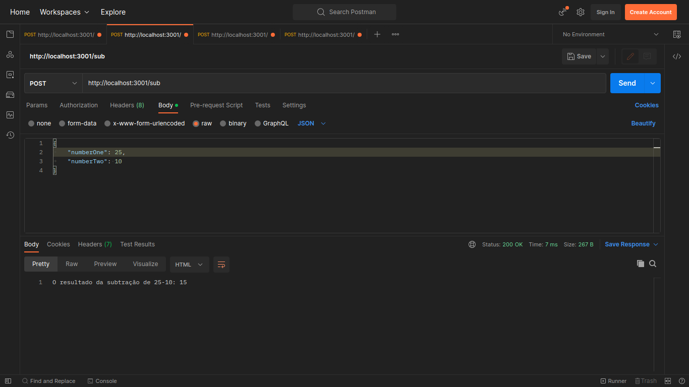
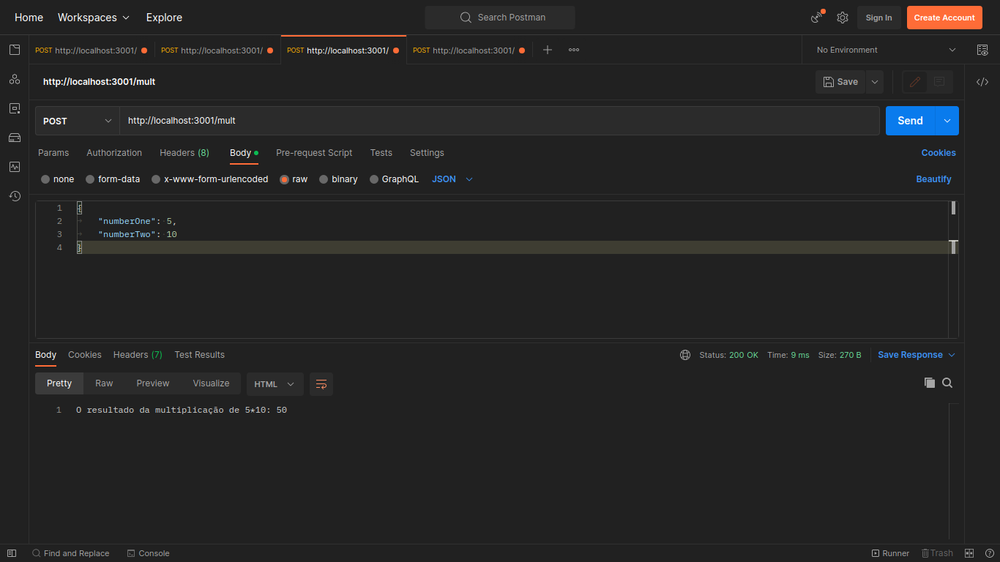
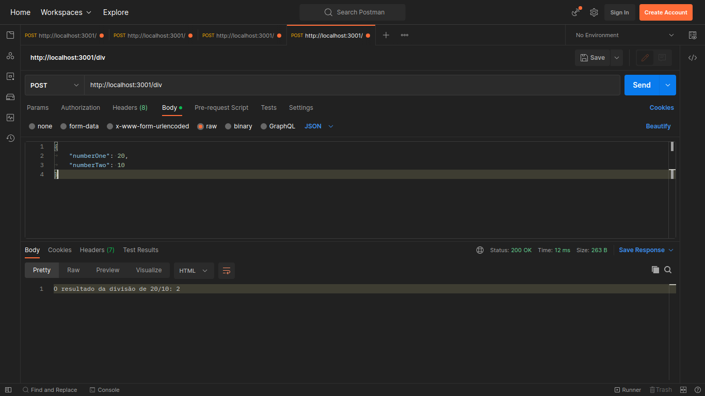

# Entregável - #3
Entregável #3 - Atividade Assíncrona Integrada

Exercício Express: Implementação de rotas utilizando NodeJS das 4 operações básicas.

<h2>Soma:</h2>

 

<h2>Subtração:</h2>

 

<h2>Multiplicação:</h2>

 

<h2>Divisão:</h2>

 
